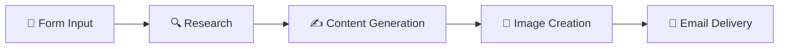

<div align="center">

# 🤖 Multi-Agent AI Workflow for Content Creation

### ⚡ Automate LinkedIn Content Creation from Hours to Minutes

[](https://n8n.io)
[](https://openai.com)
[](https://zapier.com)

**Transform 3–4 hours of content creation into 5–10 minutes**

</div>

---

## 📋 Overview

A fully automated **multi-agent AI system** that creates LinkedIn content end to end. Specialized AI agents handle research, writing, formatting, and image creation—reducing hours of work to minutes while maintaining quality and consistency.

---

## 🧠 Why Multi-Agent AI?

Instead of one AI doing everything, **specialized agents collaborate like a real team**:

* 🔍 **Research Agent** → Live web search for context
* ✍️ **Content Agent** → Generates structured posts
* 🎨 **Visual Agent** → Creates custom images
* 📧 **Delivery Agent** → Packages and sends via email

**Result:** higher quality output, better consistency, and far less manual effort.

---

## ⚙️ How It Works



1. Submit a topic via a simple form (≈2 minutes)
2. AI agents research, write, and design
3. Final post + image delivered to your inbox
4. Ready to post immediately

---

## 📊 Results

| Metric          | Before    | After    | Improvement     |
| --------------- | --------- | -------- | --------------- |
| ⏰ Time per post | 3–4 hours | 5–10 min | **~95% faster** |
| 🔧 Tools used   | 5–7       | 1        | **Simplified**  |
| 📅 Consistency  | Sporadic  | Regular  | **Sustainable** |

Automation removes friction so creativity can scale.

---

## 🛠️ Tech Stack

| Component        | Technology          |
| ---------------- | ------------------- |
| 🔧 Orchestration | n8n / Make / Zapier |
| 🤖 AI Models     | ollama llama3.2(Local)      |
| 🔍 Research      | Crawleo.dev    |
| 🎨 Visuals       | DALL·E / imagen-4 |
| 📧 Delivery      | Gmail / SendGrid    |

**No hardcore coding required** — visual workflow builders do the heavy lifting.

---

## 📁 Folder Structure

```
multi-agent-content-workflow/
├── workflows/              # n8n workflow files
├── prompts/                # AI agent prompts
├── assets/                 # Sample outputs
├── docs/                   # Architecture & notes
└── README.md
```

---

## 🎯 Use Cases

* 📝 LinkedIn content automation
* 🚀 Build-in-public workflows
* 📱 Social media consistency systems
* 🤖 Multi-agent orchestration demos
* 💼 Personal branding automation

---

## 🚀 Quick Start

```bash
# Clone repository
git clone https://github.com/OMI-KALIX/multi-agent-content-workflow.git

# Copy environment variables
cp .env.example .env

# Add your API keys
# Import workflows into n8n
# Run with a sample topic
```

**Requirements**

* n8n account (local or cloud)
* OpenAI / Anthropic API key
* Web search API access
* Email credentials

---

## 🙏 Credits

Special thanks to founder of *Crawleo.dev* **@Ahmed Ellaban** for providing free credits to explore **crawleo.dev** during this build. Support like this helps builders experiment and learn faster.

---

## 📄 License

MIT License — see the LICENSE file for details.

---

## 💬 Connect

<div align="center">

[](https://in.linkedin.com/in/omkar-sawant-953b47281)

[](mailto:omkarsawant4102004@gmail.com)

### 💡 Let’s work smarter, not harder.

⭐ Star this repo if you found it helpful

</div>
